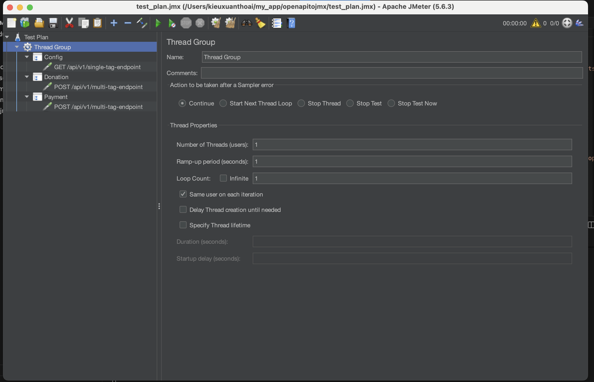

### 1️⃣ Install globally

```bash
npm install -g openapi-to-jmx
```

* The `-g` flag tells npm to install the package **globally**.
* This makes the CLI command available system-wide.

---

### 2️⃣ Run your CLI

```bash
openapi2jmx /path/to/your/test.yaml
```

**Example output:**

```
Old JMeter file removed: test_plan.jmx
Successfully loaded: sample.yaml
JMeter test plan generated: test_plan.jmx
```
** Run Jmeter ** 
```
jmeter -t test_plan.jmx 
```
